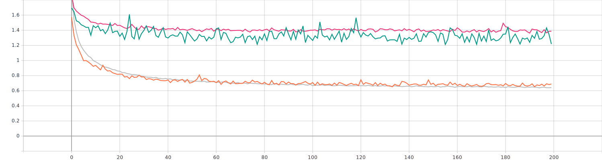
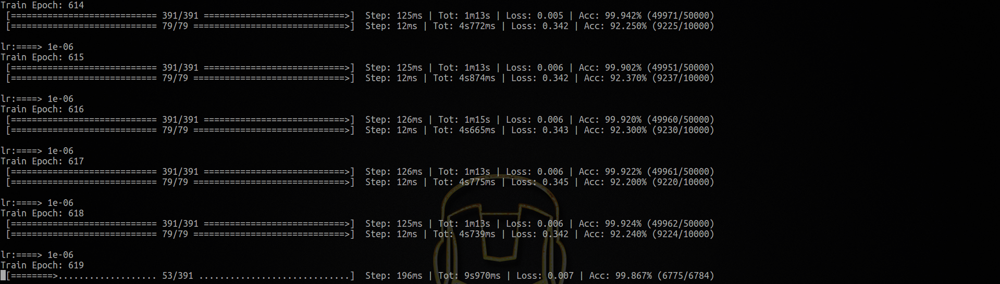
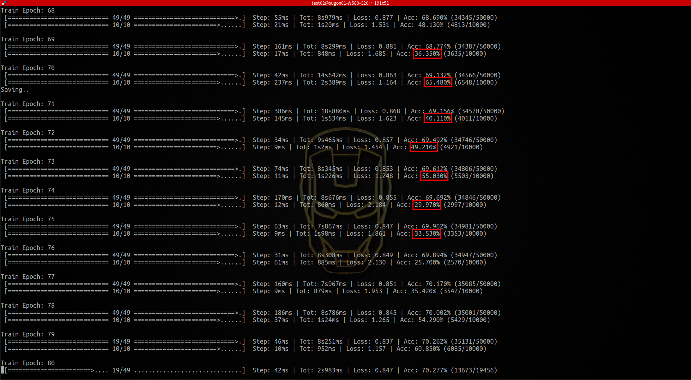

# Pytorch CNN CIFAR-10分类

## 一、环境配置

- Ubuntu 16.04
- Conda 4.5.13
- Python 2.7.13  /   3.6.3
- PyTorch 0.4.0   /   1.0.0
- CUDA Version 9.1.85

## 二、程序流程

**步骤如下**：  

1. 使用*torchvision*加载并预处理*CIFAR-10*数据集

2. 自定义卷积神经网络，结构如下图所示

   

   

   ```python
   class DaiNet7(nn.Module): # 定义卷积神经网络
       def __init__(self):
           super(DaiNet7, self).__init__() 
           self.layer1 = nn.Sequential(
               nn.Conv2d(3, 64, kernel_size = 3, padding = 1), # 输出 32*32*64
               nn.ReLU(),
               nn.BatchNorm2d(64),
               nn.Dropout(0.1))
   
           self.layer2 = nn.Sequential(
               nn.Conv2d(64, 64, kernel_size = 3, padding = 1), # 输出 32*32*64
               nn.ReLU(),
               nn.BatchNorm2d(64),
               nn.MaxPool2d(2, 2),		# 输出 16*16*64
               nn.Dropout(0.1))
   
           self.layer3 = nn.Sequential(
               nn.Conv2d(64, 128, kernel_size=3, padding=1),	 # 输出 16*16*128
               nn.ReLU(),
               nn.BatchNorm2d(128))
   
           self.layer4 = nn.Sequential(
               nn.Conv2d(128, 128, kernel_size = 3, padding=1), # 输出 16*16*128
               nn.ReLU(),
               nn.BatchNorm2d(128),
               nn.MaxPool2d(2, 2),		# 输出 8*8*128
               nn.Dropout(0.5))
   
           self.layer5 = nn.Sequential(
               nn.Conv2d(128, 256, kernel_size = 3, padding=1), # 输出 8*8*256
               nn.ReLU(),
               nn.BatchNorm2d(256),
               nn.Dropout(0.5))
   
           self.layer6 = nn.Sequential(
               nn.Conv2d(256, 256, kernel_size = 3, padding=1), # 输出 8*8*256
               nn.ReLU(),
               nn.BatchNorm2d(256),
               nn.AvgPool2d(8, 8)) 	# 输出 1*1*256
           self.fc1 = nn.Linear(1 * 1 * 256, 10)
           
       def forward(self, x):
           x = self.layer1(x)
           x = self.layer2(x)
           x = self.layer3(x)
           x = self.layer4(x)
           x = self.layer5(x)
           x = self.layer6(x)
   
           x = x.view(-1, 1 * 1 * 256)  
           x = self.fc1(x)
           return x
   ```

3. 定义损失函数和优化器 

   ```python
   # 定义损失函数和优化器 
   criterion = nn.CrossEntropyLoss()   # 损失函数为交叉熵，多用于多分类问题
   optimizer = optim.Adam(net.parameters(), lr=args.lr, betas=(0.9, 0.99), weight_decay=5e-4)
   ```

4. 训练网络并更新网络参数

5. 测试网络 

## 三、网络搭建及优化

### 最终版网络结构

经过多种网络的搭建测试，迭代了大概八九个版本，最终网络结构如下：


### 版本迭代-优化过程 

1. **修改CNN网络的定义形式**   [PyTorch中文文档](https://pytorch-cn.readthedocs.io/zh/latest/)

   给的样例中的CNN网络定义形式如下：

   ```python
   class Net(nn.Module):
       def __init__(self):
           super(Net, self).__init__() 
           self.conv1 = nn.Conv2d(3, 6, 5) 
           self.pool = nn.MaxPool2d(2, 2) 
           self.conv2 = nn.Conv2d(6, 16, 5)  
           self.fc1 = nn.Linear(16 * 5 * 5, 120) 
           self.fc2 = nn.Linear(120, 84)
           self.fc3 = nn.Linear(84, 10)
       def forward(self, x):
           x = self.pool(F.relu(self.conv1(x)))
           x = self.pool(F.relu(self.conv2(x)))
           x = x.view(-1, 16 * 5 * 5) 
           x = F.relu(self.fc1(x))
           x = F.relu(self.fc2(x))
           x = self.fc3(x)
           return x
   ```

   这种定义方式很简单，但是对于层数多一点的网络可能看起来就不那么直观了，所以后期使用了`nn.Sequential`将多个层写在一起，如下：

   ```python
           self.layer1 = nn.Sequential(
               nn.Conv2d(3, 12, kernel_size = 5, padding=2),
               nn.Dropout(0.5),
               nn.BatchNorm2d(12),
               nn.ReLU(),
               nn.MaxPool2d(2, 2))
   ```

2. **增加卷积核的个数（Feature Map通道个数增加），增加Dropout(0.5)随机失活**


   

   

   > 紫红色为train_accuracy、train_loss	蓝绿色为test_accuracy、test_loss	epoch：200

   *test_accuracy*可以达到<font color=red>**59.68%**</font>，存在问题：*test_loss*比*train_loss*的值要小

3. **增加了一层卷积，并且修改学习率，在上一个网络参数不变的情况下，将学习率由0.1调整为0.001**

   

   

   > 紫红色为*train_accuracy*、*train_loss*	蓝绿色为*test_accuracy*、*test_loss*	*epoch*：200
   >
   > 学习率调整为0.001后 灰色为*train_accuracy*、*train_loss* 橙色为*test_accuracy*、*test_loss*

   *test_accuracy*可以达到<font color=red>**77.89%**</font>，*test_loss*与*train_loss*的差距不大

4. **Data Augmentation数据增强**

   ```python
   transform_train = transforms.Compose([  	# 通过compose将各个变换串联起来
       transforms.RandomCrop(32, padding=4),   # 先四周填充0，再把图像随机裁剪成32*32
       transforms.RandomHorizontalFlip(),      # 以0.5的概率水平翻转给定的PIL图像
       # transforms.RandomAffine(5.0),         # python2.7 好像没有
       # transforms.RandomGrayscale(p=0.1),   	# 依概率 p 将图片转换为灰度图
       # transforms.ColorJitter(brightness=0.3, contrast=0.3, saturation=0.4, hue=0.4),
       transforms.ToTensor(),
       transforms.Normalize((0.4914, 0.4822, 0.4465), (0.2023, 0.1994, 0.2010)), 
       #R,G,B每层的归一化用到的均值和方差
   ])
   ```

   这一部分代码有对数据进行了更多的处理，比如以0.5的概率水平翻转、*RandomAffine*仿射变换、*RandomGrayscale*转化为灰度图、*ColorJitter*修改亮度、对比度、饱和度等等，如上边代码所示，当我增加了三个注释行之后，效果好像变得更差了……所以后期又注释掉了。在最终版的DaiNet7上再次进行了测试，发现两者可达到的精度类似，没有显著的提高，同时也说明了**数据集对于这两种变换不是很敏感**。

5. **按1中的方式整改网络结构，添加Batch Normalization** [参考文章](https://www.cnblogs.com/guoyaohua/p/8724433.html) [参考文章2](https://blog.csdn.net/qq_25737169/article/details/79048516)

   ```python
   def __init__(self):
           super(DaiNet1, self).__init__()
           self.layer1 = nn.Sequential(
               nn.Conv2d(3, 12, kernel_size = 5, padding=2),
               nn.Dropout(0.5),
               nn.BatchNorm2d(12),
               nn.ReLU(),
               nn.MaxPool2d(2, 2))
           self.layer2 = nn.Sequential(
               nn.Conv2d(12, 24, kernel_size=3, padding=1),
               nn.BatchNorm2d(24),
               nn.ReLU(),
               # nn.Dropout(0.5),
               nn.MaxPool2d(2, 2))
           self.layer3 = nn.Sequential(
               nn.Conv2d(24, 12, kernel_size=3, padding=1),
               nn.BatchNorm2d(12),
               nn.ReLU(),
               ## nn.Dropout(0.5),
               nn.MaxPool2d(2, 2))
           self.fc1 = nn.Linear(12 * 4 * 4, 128)
           self.fc2 = nn.Linear(128, 84)
           self.fc3 = nn.Linear(84, 10)
   ```

   这个时候，就出现了一个问题，*BatchNorm2d、ReLU、Dropout、MaxPool2d*等层的顺序及是否添加*Dropout*，添加*Dropout*后失活的概率设置为多少合适*0.1* or *0.5*


   > 上边两张图应该是每个*Sequential*都设置*Dropout*时的曲线，蓝色为*train*，紫色为*test*		epoch:200
   >
   > 下面两张图为取消了后两层*Sequential*的*Dropout*，调整了一些顺序之后，绿色为*train*，灰色为*test*

   还有一些其他的图，由于文章篇幅有限不再展示，可以看出，调节顺序，增加或取消一些层，都有一些影响

   *test_accuary*可以达到<font color=red>**77.76%**</font>，*test_loss*与*train_loss*的差距不大

6. **更改优化器，将SGD改为Adam** [参考文章-pytorch中使用torch.optim优化神经网络以及优化器的选择](https://ptorch.com/news/54.html)

   所有的优化器Optimizer都实现了step()方法来对所有的参数进行更新，`optimizer.step()`

   按理论上来说Adam要比SGD效果好一点，所以更换了优化器，但是没有存下训练和测试的对比图

   Adam的特点有： 

   - 结合了Adagrad善于处理稀疏梯度和RMSprop善于处理非平稳目标的优点
   - 对内存需求较小
   - 为不同的参数计算不同的自适应学习率
   - 也适用于大多非凸优化-适用于大数据集和高维空间

   > SGD 是最普通的优化器, 也可以说没有加速效果, 而 Momentum 是 SGD 的改良版, 它加入了动量原则. 后面的 RMSprop 又是 Momentum 的升级版. 而 Adam 又是 RMSprop 的升级版. 不过从下面结果中我们看到, Adam 的效果似乎比 RMSprop 要差一点. 所以说并不是越先进的优化器, 结果越佳. 在试验中可以尝试不同的优化器, 找到那个最适合数据/网络的优化器

   

7. **是否添加softmax层**

   这个论述可以[参考文章-pytorch 计算 CrossEntropyLoss 需要先经 softmax 层激活吗](https://www.jianshu.com/p/e184663e2f8a)

   简言之就是，在*CrossEntropyLoss*计算交叉熵时候，自己计算了一个*softmax*，所以不需要自己额外增加一层，否则就相当于是有两个*softmax*层

8. **减少全连接层的数量**

   某篇博客中提到了在做CNN分类问题的时候，全连接层数量过多可能会导致效果不太好，所以将原来样例中的的3个全连接层减小为1个全连接层。

   > 好像是因为：卷积层其实能够更多的体现图像的信息，而全连接层可能导致信息丢失

9. **batch_size大小的调节** [参考链接](https://blog.csdn.net/u010417185/article/details/79533539)

   一般来说，在合理的范围之内，越大的 *batch size* 使下降方向越准确，震荡越小；*batch size* 如果过大，则可能会出现局部最优的情况。小的 *bath size* 引入的随机性更大，难以达到收敛，极少数情况下可能会效果变好。

   

   

   如上图，对于DaiNet7，分别使用` batch_size=128`和` batch_size=1024`，其他参数保持不变，粉色和绿色（长的）分别为` batch_size=1024`时的*train*和*test*，深红色和青蓝色（短的）分别为` batch_size=128`时的*train*和*test*。

   当*batch_size*变大之后，*train_loss*变小了，但是*test_loss*变大了；*train_accuracy*变大了，但是*test_accuracy*变小了，即两个的*Generlization Gap*变大了。

   

10. **激活函数 Sigmoid,Tanh,ReLu,softplus,softmax**

    因为上课老师讲到过*ReLU*会出现下图的这种情况，所以想到了换激活函数,  有一个*Softplus*函数，公式如下：$f(x) = log(1+e^x)$，如右图所示， 但是更换之后效果不是很明显，且增加了计算量，所以又换回了*ReLU*。

    

    

11. **动态调整学习率Learning Rate**

   具体实现如下：

   ```python
   def adjust_learning_rate(optimizer, epoch):
       if epoch < 50 :
           lr = 0.001
       elif epoch < 100 :
           lr = 0.0005
       elif epoch < 150 :
           lr = 0.0003
       elif epoch < 200 :
           lr = 0.0001
       elif epoch < 230 :
           lr = 0.00001
       else :
           lr = 0.000001
   
       for param_group in optimizer.param_groups:
           param_group['lr'] = lr
       print('\nlr:====>',lr)
   for epoch in range(start_epoch, start_epoch+1000):
       adjust_learning_rate(optimizer,epoch)
   	   train(epoch)
   	   test(epoch)
   ```

据查阅，pytorch有自带的学习率调节函数，但是我还是没有采用它，本实验中仍然使用的是上段代码中的`if - else`判断，在下边的结果展示中，同样可以看到，*accuracy*曲线突然增高，即学习率发生改变

   ```python
   torch.optim.lr_scheduler.ReduceLROnPlateau(optimizer, mode='min', factor=0.1, patience=10, verbose=True, threshold=0.0001, threshold_mode='rel', cooldown=0, min_lr=0, eps=1e-08)
   ```

## 四、结果展示与对比

### DaiNet7结果展示


- 该网络在`batch_size=128`的情况下，*test_accuracy*可以达到<font color=red>**91.91%**</font>，如下图，紫色为*train*，绿色为*test*


<center>DaiNet7_Accuracy</center>


<center>DaiNet7_Loss</center>


<center>模型训练过程中的某次最优结果保存</center>

- 该网络在`batch_size=1024`的情况下，结果在上一章节3.9 *batch_size*调节中有做对比，这里不在重复展示

### 与ResNet50结果对比

- *ResNet50*在我的一些参数下，结果如下图


上图中，灰色的为*train*，橙色的为*test*，不得不说Resnet是真的强大，对于训练数据的拟合，*train_accuracy*可以达到<font color=red>**99.94%**</font>，*test_accuracy*可以达到<font color=red>**92.50%**</font>，不过这个结果并没有完全展示RestNet的实力，在网站看到有的博客可以使用ResNet达到95.5%左右的正确率，所以除了网络的结构，一些其他的参数对于结果也是比较重要的，比如学习率，图像增广等或者一些其他的Track。



<center>ResNet50模型训练过程</center>

- *ResNet50*和我的网络*Dainet7*对比图所示


如上图所示，灰色和橙色分别为*ResNet50*的*train*和*test*，紫红色和绿色分别为*DaiNet7*的*train*和*test*，在*train_accuracy*方面两个有较大的差距，大概能差7个百分点左右，但是两者在**test_accuracy**方面相差不大，大概0.5个百分点左右，但是在训练速度方面，*DaiNet7*要比*ResNet*更占优势，在使用*GTX 1080Ti*显卡时，DaiNet7一个epoch平均大概需要23s左右，ResNet50则需要73s左右，两者的差距还是挺明显的。

## 五、使用TensorboardX可视化

> Tensorboard 是 TensorFlow 的一个附加工具，可以记录训练过程的数字、图像等内容，以方便研究人员观察神经网络训练过程。  [参考文章-详解PyTorch项目使用TensorboardX进行训练可视化](https://blog.csdn.net/bigbennyguo/article/details/87956434)

### 安装TensorboardX

```shell
pip install tensorboardX
```

### Accuracy-Loss曲线绘制

```python
from tensorboardX import SummaryWriter

# Creates writer1 object.
# The log will be saved in 'runs/exp'
writer1 = SummaryWriter('runs/exp')

# Creates writer2 object with auto generated file name
# The log directory will be something like 'runs/Aug20-17-20-33'
writer2 = SummaryWriter()

# Creates writer3 object with auto generated file name, the comment will be appended to the filename.
# The log directory will be something like 'runs/Aug20-17-20-33-resnet'
writer3 = SummaryWriter(comment='resnet')
```

以上展示了三种初始化 *SummaryWriter* 的方法：

- 提供一个路径，将使用该路径来保存日志
- 无参数，默认将使用`runs/日期时间`路径来保存日志
- 提供一个`comment`参数，将使用`runs/日期时间-comment`路径来保存日志

接下来，我们就可以调用 *SummaryWriter* 实例的各种 *add_something* 方法向日志中写入不同类型的数据了：

```python
from tensorboardX import SummaryWriter

writer = SummaryWriter('runs/scalar_example')

for i in range(10):
    writer.add_scalar('quadratic', i**2, global_step=i)
    writer.add_scalar('exponential', 2**i, global_step=i)

writer2 = SummaryWriter('runs/another_scalar_example')
for i in range(10):
    writer2.add_scalar('quadratic', i**3, global_step=i)
    writer2.add_scalar('exponential', 3**i, global_step=i)
```

想要在浏览器中查看可视化这些数据，只要在命令行中开启`tensorboard`即可：

```shell
tensorboard --logdir <your_log_dir>
# 例如：
tensorboard --logdir runs
```

其中的`<your_log_dir>`既可以是单个`run`的路径，如上面`writer1`生成的 `runs/exp`；也可以是多个`run`的父目录，如`runs/`下面可能会有很多的子文件夹，每个文件夹都代表了一次实验，我们令`--logdir=runs/`就可以在 tensorboard 可视化界面中方便地横向比较`runs/`下不同次实验所得数据的差异。


### CNN网络结构图Graph绘制

```python
import torch
import torch.nn as nn
import torch.nn.functional as F
import torchvision
from torch.autograd import Variable
from tensorboardX import SummaryWriter

dummy_input = (torch.zeros(1, 3),)
# torch.rand(1, 3, 32, 32) 在DaiNet7中使用的

class LinearInLinear(nn.Module):
    def __init__(self):
        super(LinearInLinear, self).__init__()
        self.l = nn.Linear(3, 5)

    def forward(self, x):
        return self.l(x)

with SummaryWriter(comment='LinearInLinear') as w:
    w.add_graph(LinearInLinear(), dummy_input, True)
```

> 参考Github官方样例[链接](https://github.com/lanpa/tensorboardX/blob/master/examples/demo_graph.py)

- 绘制Graph如下图所示（图片太长 为方便添加 旋转90°）


## 六、存在问题及解决办法

1. **样例运行时候报错找不到models**

  ```python
    python main.py 
    Traceback (most recent call last):
      File "main.py", line 16, in <module>
     from models import *
    ImportError: bad magic number in 'models': b'\x03\xf3\r\n'
  ```

  ```shell
  # 解决办法
  cd models
  ls -a  #　会看到一些pyc文件
  rm *.pyc
  ```


2. **错误：维度大小不一致**


在定义卷积神经网络的时候，需要计算一下每层的数据维度，保证各个连接起来的时候，大小正确且一致

```python
        ......
    	self.layer6 = nn.Sequential(
            nn.Conv2d(256, 256, kernel_size = 3, padding=1),
            nn.ReLU(),
            nn.BatchNorm2d(256),
            nn.AvgPool2d(8, 8)
        )
        self.fc1 = nn.Linear(1 * 1 * 256, 10)  	# 这里的维度
        ......
 		x = x.view(-1, 1 * 1 * 256)				# 还有这里的维度 需要计算正确
```

3. **train很稳定，但是test忽大忽小，波动很大**

  如下图，没找到问题的原因，不过后来直接换网络了，也就没这个问题了




